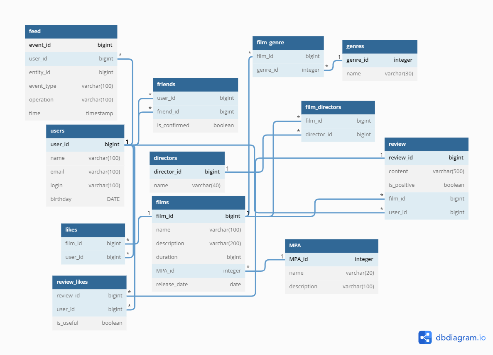

# java-filmorate
## Description
 This is a service for determining movie ratings based on user likes.

The following commands are available in this service:
1. To manage users:
- Create a user;
- Update user;
- Add user to friends;
- Remove user from friends;
- Get a list of all users;
- Get the user by his Id;
- Get a list of user's friends;
- Get a list of mutual friends of users of two users;
2. To manage films:
- Add film;
- Update film;
- Add a like to the film;
- Remove like film;
- Get a list of all films;
- Get a film by its Id;
- Get top N films sorted in descending order of rating;
- Get a list of all film genres;
- Get a list of all film age ratings;
- List of the most popular films by genre and year;
- adding reviews and their usefulness;
- Get recommendations for films to watch;
- Add directors;
- Search films;
- Get the user's event feed;
- Returns a list of films sorted by popularity.

## Database

## Description of tables

#### *MPA*
This table is intended for storing a list of age ratings that can be assigned to film.

- **MPA_id** - rating ID;
- **name** - rating name;
- **description** - rating description.

#### *genres*
This table keeps a list of available movie genres:

- **genre_id** - genre ID;
- **name** - genre name.

#### *films*
This table keeps a list of film:

- **film_id** - film ID;
- **name** - film name;
- **description** - film description;
- **duration** - film duration;
- **MPA_id** - rating ID;
- **release_date** - release date film.

#### *film_genre*
This table keeps a list of film and genre matches:

- **film_id** - film ID;
- **genre_id** - genre ID.

#### *likes*
This table contains information about who liked what movie:

- **film_id** - film ID.
- **user_id** - user ID.

#### *users*
This table contains information about users:

- **user_id** - user ID;
- **email** - user email;
- **login** - user login;
- **name** - user name;
- **birthday** - user's birthday.

#### *friends*
This table contains information about users' friends:

- **user_id** - user ID;
- **friend_id** - friend ID;
- **is_confirm** - friendship status.

#### *review*
- **review_id** - review ID;
- **content** - content;
- **is_positive** - false - positive, true - negative;
- **film_id** - film ID;
- **user_id** - user ID;

#### *review_likes*
- **review_id** - review ID;
- **user_id** - user ID;
- **is_useful** - false - positive, true - negative;

#### *directors*
- **director_id bigint** - director ID;
- **name** - director's name;

#### *film_directors*
- **film_id** - film ID;
- **director_id** - director ID;

#### *feed*
- **event_id** - event ID;
- **user_id** - user ID;
- **entity_id** - entity ID;
- **event_type** - event type;
- **operation** - operation;
- **time** - event time;

### Examples SQL queries for films:

    SQL_ADD_FILM = INSERT INTO films (
            name,
            description,
            release_date,
            duration,
            MPA_id) 
            VALUES (?, ?, ?, ?, ?);
    SQL_UPDATE_FILM = UPDATE films SET
            name = ?,
            description = ?,
            release_date = ?,
            duration = ?,
            MPA_id = ?
            WHERE film_id = ?;
    SQL_DELETE_FILM = DELETE FROM films WHERE film_id = ?;
    SQL_ADD_LIKE = INSERT INTO likes (film_id, user_id) VALUES (?, ?);
    SQL_DELETE_LIKE = DELETE FROM likes WHERE film_id = ? AND user_id = ?;
    SQL_GET_LIKES_BY_FILM_ID = SELECT user_id FROM likes WHERE film_id = ?;
    SQL_GET_GENRE_BY_FILM_ID = SELECT genre_id FROM FILM_GENRE WHERE film_id = ? ORDER BY genre_id;
    SQL_ADD_GENRE = INSERT INTO film_genre (film_id, genre_id) VALUES (?, ?);
    SQL_DELETE_GENRE = DELETE FROM film_genre WHERE film_id = ?;
    SQL_GET_ALL_MPA = SELECT * FROM MPA ORDER BY MPA_id;
    SQL_GET_ALL_GENRE = SELECT * FROM genres ORDER BY genre_id;

### Examples SQL queries for users:
    SQL_GET_USERS = SELECT * FROM users ORDER BY user_id;
    SQL_GET_USER_BY_ID = SELECT * FROM users WHERE user_id = ?;
    SQL_ADD_USER = INSERT INTO users (name, email, login, birthday)
    VALUES (?, ?, ?, ?);
    SQL_UPDATE_USER =  UPDATE users SET name = ?, email = ?, login = ?,
    birthday = ?
    WHERE user_id = ?;
    SQL_ADD_FRIEND = INSERT INTO friends (user_id, friend_id) VALUES (?, ?);
    SQL_CONFIRM_FRIEND = UPDATE friends SET is_confirmed = ?
    WHERE user_id = ? AND friend_id = ?;
    SQL_DELETE_USER_BY_ID = DELETE FROM users WHERE user_id = ?;
    SQL_DELETE_FRIEND = DELETE FROM friends WHERE user_id = ? AND friend_id = ?;
    SQL_GET_FRIEND_BY_ID = SELECT friend_id FROM friends WHERE user_id = ?;
    SQL_GET_STATUS_FRIEND = SELECT is_confirmed FROM friends WHERE user_id = ?
    AND FRIEND_ID = ?;